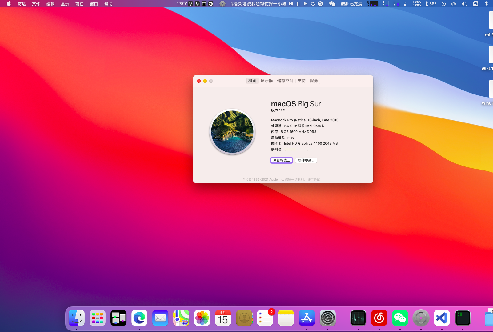

## 联想小新V1000黑苹果EFI驱动
### 适配系统：Big Sur 11.3  OpenCore 0.6.8
### 系统截图

### 已解决问题：
| 已解决                                                       |
| ------------------------------------------------------------ |
| 屏蔽独显                                                     |
| 电池电量显示                      |
| 显存修改为2048MB（Hackintool生成hd4400缓冲帧补丁）           |
| 亮度调节、亮度保存（hotpatch）                               |
| 有线网卡（使用RealtekRTL8111.kext）                          |
| 声卡（使用AppleAlc.kext仿冒设备，万能驱动11.3不支持）                                   |
| 自带键盘、触摸板（使用ApplePs2SmartTouchpad.kext）             |
| 蓝牙（使用IntelBluetoothFirmware.kext、IntelBluetoothInjector.kext） |

#### 目前能较完美运行最新的Big Sur系统，当前未解决睡眠问题
### 安装
直接使用将目录复制到EFI分区中
